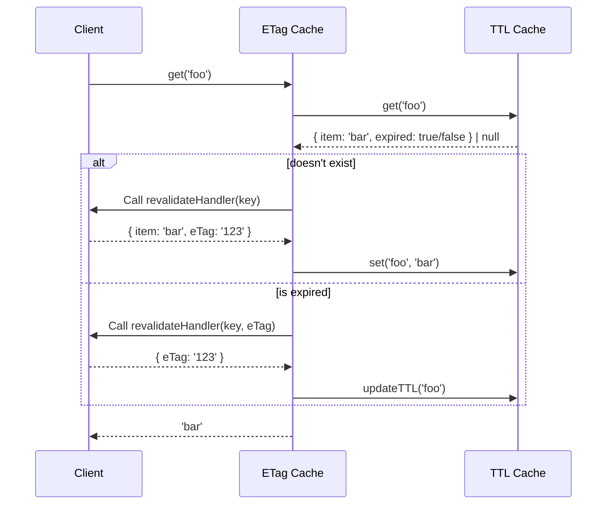

# eTag cache

Simple in-memory caching solution that supports revalidation via eTag and time-to-live (TTL).

## Usage

```ts
import { ETagCache } from '@millihq/etag-cache';

async function revalidateHandler(key: string, eTag?: string) {
  if (eTag === '123') {
    // When the item of the cached item has not changed, you can simply return
    // the eTag and the expiration of the item in the cache gets updated.
    return {
      eTag: '123',
    };
  }

  return {
    item: 'bar',
    eTag: '123',
  };
}

const cache = ETagCache(60 /* TTL in seconds */, revalidateHandler);

const item = await cache.get('foo');
// => bar
```

## Architecture

The cache is designed with a focus on reading performance.
Expired items are only purged from the cache when new items are added to the cache.



## About

This project is maintained by [milliVolt infrastructure](https://milli.is).  
We build custom infrastructure solutions for any cloud provider.

## License

Apache-2.0 - see [LICENSE](https://github.com/milliHQ/pixel/tree/main/LICENSE) for details.
